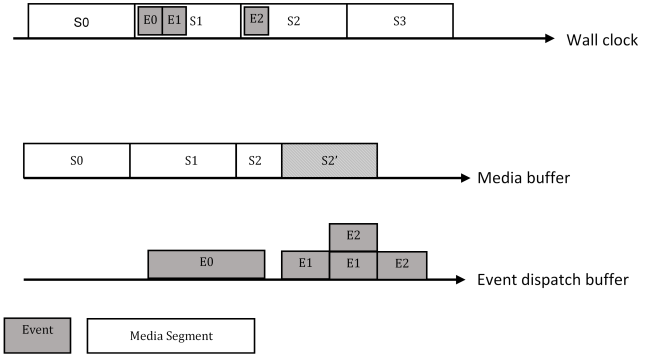

# DASH inband event processing using MSE data model

Iraj Sodagar, irajs@live.com

Tencent America

2021-05-17

## Introduction

This document provides an extended W3C [Media Source Extensions](https://w3c.github.io/media-source/) (MSE) model for the processing of DASH inband events.

Note: The current MSE specification does not support the processing of inband events and this document is just one possible illustrative design on how MSE can be extended to support such functionality.

## Process@append rule

The process@append rule means that the inband events of a segment are processed, i.e. parsed, and dispatched or scheduled to dispatch at the time of appending the segment to the MSE [SourceBuffer](https://w3c.github.io/media-source/#sourcebuffer).

In the case of an inband event with the **on_receive** dispatch mode:

1. If the event end time is not smaller than the current playback position, and
2. If this event or an equivalent has not been dispatched before,

Then the dispatcher dispatches the event immediately.

In the case of an inband event with the **on_start** dispatch mode:

1. If the current playback position is  not smaller than the event start time, and
2. If the current playback position is not equal or larger than the event end time, and
3. If this event or an equivalent has not been dispatched before,

Then the event is stored in a dispatch buffer for dispatching at the event start time.

## Dispatch buffer timing model

Figure 1 demonstrates an inband event with the **on_start** dispatch mode relative to the MSE timing model.

  

Figure 1. Media source and in-band event dispatch buffers

## Implementation

Figure 2 demonstrates an example of the overlapping events with **on_start** dispatch mode.

  

Figure 2. Event buffer model example for **on_start** events

As is shown above, emsgs E0, E1, and E2 are mapped to the dispatch buffer. With the initial appending of the S1 media segment to the media buffer, the ranges between the event's start and the event's end are marked in the dispatch buffer for E0 and E1.

When S2 is appended to the media buffer, in this case since E2 overlaps with E1 in the dispatch buffer, the corresponding range in the dispatched first is divided into 3 subranges, as shown in the figure.

Figure 3 demonstrates an example of an overwrite, in which the segment S2 is overwritten by a new segment S2' (that does not contain any emsgs) and has a duration that only covers a portion of S2 in the media buffer.

  

Figure 3. Overwrite of a part of a segment with events having **on_start** dispatch mode

As shown, since the event E2 has the **on_start** dispatch mode, its range in the dispatch buffer is unchanged.

## Algorithms

### Initialization

1. Applications inputs to DASH client
   1. Subscribe SchemeIdURI/value
   2. Provide dispatch mode
2. Event buffer initialization:
   1. Event dispatch (range of event purge may go beyond media buffer)
3. Set Presentation Time Offset (PTO)

### Append

1. Parse media samples
2. Append media samples to media buffer, calculate its start in media source buffer (segment_start)
3. For each emsg
    1. Parse emsg
    2. Calculate event start and end times, and compare it to the current playback position.
    3. If
        1. event's end time < current playback position or
        2. its emsg.id exists in the "already-dispatched" table then stop processing this emsg and go to Step 3 to start processing the next emsg.
    4. If dispatch_mode = on_receive
        1. Dispatch the event
        2. Add its emsg.id to the "already-dispatched" table
        3. Go to Step 3 to start processing the next emsg.
    5. Otherwise (dispatch_mode = on_start):
        1. Calculate the event dispatch range:
            1. For emsg v0 (esmg.version = 0): dispatch_range_start = segment_start + emsg.presentation_time_delta / emsg.time_scale
            2. For emsg v1 (emsg.version = 1): dispatch_range_start = emsg.presentation_time/emsg.timescale
            3. dispatch_range_end = dispatch_range_start + emsg.duration / emsg.timescale
        2. If there is already existing event in the dispatch range:
            1. Divide the range to subranges, such that each subrange is either
                1. empty (no event), or
                2. is occupied with one or more events
            2. For each subrange:
                1. Add a new event constaining:
                    1. emsg.scheme_id_uri
                    2. emsg.value
                    3. emsg.id
                    4. dispatch_range_start
                    5. dispatch_duration = emsg.duration/emsg.timescale
                    6. emsg.message_data()

### Dispatch

1. Find the events occurring in the dispatch buffer at the playback position.
2. For each event
    1. If its emsg.id is not in the "already-dispatched" table,
        1. Dispatch the event
        2. Add its emsg.id to the "already-dispatched" table
        3. Remove the event from the dispatch buffer
    2. Otherwise, remove the event from the dispatch buffer

### Purge

In a purge operation, either a range from the start or a range from the end of the media buffer is purged. This range is referred to as the "purged-range" in this subclause.

1. If any event in the dispatch buffer overlaps with the purged-range
    1. Split the event into two events around the purge-range boundary
2. Remove the purged-range from the dispatch buffer
